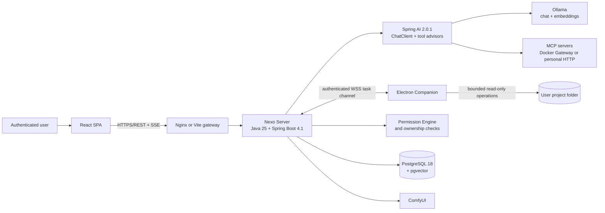
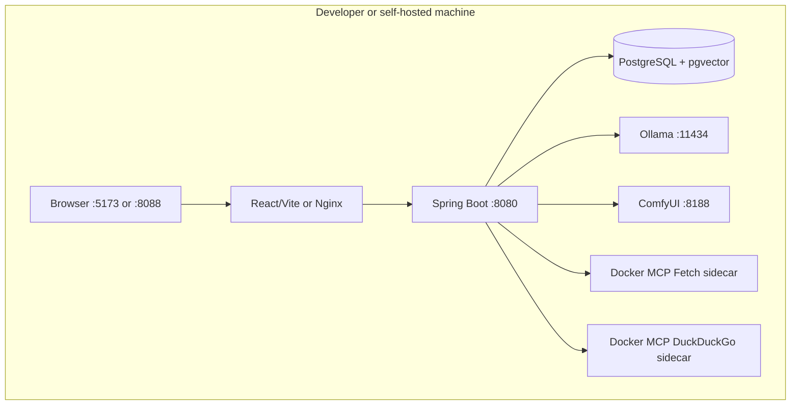
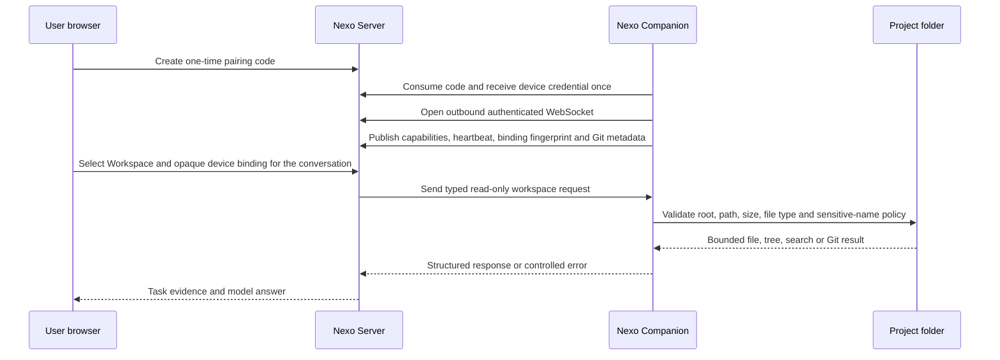
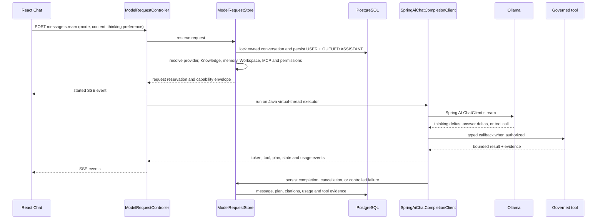
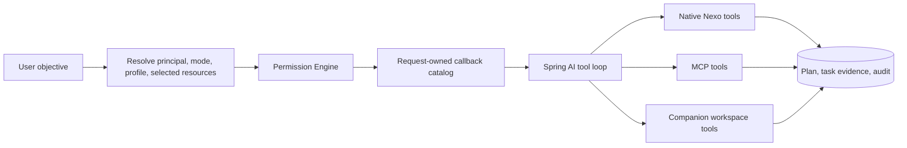
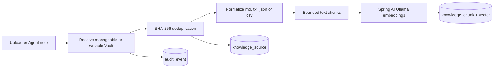

# Nexo IA current architecture

> Verified against `codex/server-workspace-execution` on 2026-08-27. This document describes the
> runtime that exists in the repository today. Product intentions that do not yet have an
> authoritative backend are identified explicitly as partial or deferred.

## 1. Architectural summary

Nexo IA is a **client-server AI workspace** built as a Java modular monolith with two user surfaces:

- a React web application for interaction and operational visibility;
- an optional Electron Companion for safely reading a project that remains on another computer.

The Spring Boot server is the authority for identity, ownership, conversation state, model routing,
context assembly, permission resolution, plans, tool evidence, Knowledge retrieval, usage, and audit.
The model is never the authority for its own capabilities. For each request, deterministic server
code decides which context and tool callbacks exist before Spring AI calls the selected model.



The central design rule is:

```text
the user selects resources
  -> the server resolves identity, ownership, policy, and availability
  -> Spring AI receives only the resulting request-scoped context and tools
  -> every effect produces persisted state, bounded evidence, or an explicit failure
```

## 2. Runtime and deployment boundaries

### 2.1 Processing location versus execution location

Nexo records or exposes two different concepts that must not be confused:

| Concept | Meaning | Current examples |
|---|---|---|
| Processing location | Where the model or service processes the supplied context | local or remote Ollama endpoint, Nexo Server, ComfyUI |
| Execution location | Where a concrete tool effect happens | Nexo Server, an MCP server, or the paired user's computer |

The browser renders state and sends intentions. It does not receive filesystem, process, database,
or MCP authority merely because the page is open.

### 2.2 Local single-machine topology



Compose separates the services into three networks:

- `nexo-edge`: the frontend and backend entry path;
- `nexo-internal`: PostgreSQL and server persistence traffic;
- `nexo-mcp`: backend-to-MCP-Gateway traffic.

PostgreSQL and MCP sidecars are not published by the production Compose topology. Development may
publish PostgreSQL only on loopback. Host Ollama and ComfyUI are reached through
`host.containers.internal` by default.

### 2.3 Server plus another computer



The project does **not** need to be copied to the server. The server stores the Workspace record,
device identifier, opaque local binding identifier, status, structure fingerprint, and Git metadata.
Only the Companion stores the absolute local path. The current Companion capabilities are read-only:
list files, read a text file, literal search, inspect the project, Git status, and Git diff.

Loopback remains the safe default. `NEXO_BIND_ADDRESS=0.0.0.0` is an explicit trusted-LAN opt-in.
Untrusted or internet exposure additionally requires HTTPS/WSS, secure cookies, a trusted reverse
proxy, firewall policy, signed Companion distribution, and normal production hardening.

## 3. Repository structure and responsibility

```text
nexo-ia/
  backend/    Java 25 modular monolith and authoritative runtime
  frontend/   React 19 SPA and all visible product workspaces
  desktop/    Electron Companion and endpoint-local read-only adapters
  docs/       Markdown source of truth plus the generated HTML portal
  scripts/    setup, startup, documentation, smoke, and validation automation
  compose*.yaml
```

### 3.1 Backend modules

The backend is one deployable Spring Boot application. Package boundaries express domains without
introducing premature services or network calls.

| Package | Current responsibility |
|---|---|
| `auth` | Owner bootstrap, users, profiles, credentials, JWT/refresh sessions, recovery, access events |
| `team` | Team creation, membership, administrative roles, shared owner-scope resolution |
| `permission` | Pure deterministic capability and content-policy resolution |
| `provider` | User-owned provider registry, model discovery, endpoint guard, Spring AI Ollama adapter |
| `conversation` | Conversations, messages, context assembly, Agent plans, tool evidence, SSE lifecycle |
| `knowledge` | Vaults, source ingestion, embeddings, chunks, retrieval, citations, semantic graph |
| `memory` | Explicit personal memory CRUD and governed `remember` tool |
| `mcp` | Catalog, user-owned connections, discovery, allow-list, request-owned clients, governed calls |
| `workspace` | Server workspaces, bindings, tree/file inspection, Spring AI workspace callbacks |
| `device` | Pairing, credentials, inventory, WebSocket runtime protocol, pending request correlation |
| `media` | Asynchronous ComfyUI image jobs and persisted artifacts |
| `usage` | Authenticated aggregate token and latency reporting |
| `audit` | Correlated security, model, knowledge, device, media, and tool events |
| `shared` | Base responses, exception translation, security configuration, common infrastructure |

Within a domain, the intended direction is:

```text
controller / transport
  -> application service
  -> domain model and policy
  -> repository or external adapter
```

Controllers do not expose JPA entities. External boundaries use request/response records, structured
errors, and explicit adapters. Long model streams do not hold a database transaction open.

### 3.2 Frontend modules

The React application is organized by product capability rather than by one global components
folder. React Router lazy-loads Home, Chat, Projects, Cowork, Tasks, Teams, Vaults, Skills, MCP,
Settings, and Administration inside one responsive `100dvh` shell.

Frontend state follows three rules:

1. TanStack Query owns authenticated server state and invalidation.
2. Zustand owns client-only UI preferences, transient drafts, current streams, and preview catalogs.
3. Zod validates untrusted API and persisted-browser boundaries before components consume them.

Axios handles ordinary authenticated REST. A dedicated streaming client handles SSE, access-token
refresh coordination, cancellation, and re-authentication. The frontend displays plans, tasks,
citations, token usage, model capabilities, Workspace status, MCP availability, and media jobs; it
does not decide which tool the server attaches.

### 3.3 Desktop Companion

Electron uses context isolation, a sandboxed renderer, a narrow preload API, and denied arbitrary
window navigation. The main process owns:

- secure device and local binding storage;
- the outbound authenticated `nexo.runtime.v1` WebSocket;
- capability and heartbeat publication;
- filesystem containment and sensitive-file policy;
- fixed-argument Git reads;
- structured responses to server requests.

The renderer never receives the device credential or absolute local workspace paths.

## 4. Authentication, authorization, and isolation

### 4.1 Browser session

Spring Security is default-deny. Authentication uses:

- a short-lived JWT in the `HttpOnly` `NEXO_ACCESS` cookie;
- an opaque rotating refresh token in the narrower `NEXO_REFRESH` cookie;
- server-side session state and current access `jti` validation;
- refresh-token hashes at rest and session compromise on detected reuse;
- SPA CSRF cookie/header enforcement;
- immediate session revocation for logout, disabled accounts, password changes, and administration.

### 4.2 Device session

The Companion consumes a short-lived, single-use pairing code. The raw device credential is returned
once, stored on that device, and sent as `Authorization: Device ...` for runtime HTTP and WebSocket
traffic. It is independently revocable from browser sessions.

### 4.3 Resource isolation

Most personal repositories query by authenticated `user_id` or resolve an owned parent first.
Shared Knowledge uses one central scope resolver:

```text
accessible owner ids = authenticated user id + ids of Teams the user belongs to
```

That same set controls Vault listing, conversation selection, retrieval, and graph construction.
Team administration is separate from Team membership. Unauthorized resources normally appear as
not found, avoiding identifier disclosure.

The current implementation has Owner, Member, Team, role, profile, and shared Team Vault concepts.
A separate persisted organization-root entity and full organization budgets are still deferred.

## 5. Conversation and Agent request lifecycle



### 5.1 Reservation transaction

Before streaming begins, the server:

1. resolves the authenticated conversation with a write lock;
2. requires a persisted provider configuration and selected model;
3. verifies the provider endpoint and processing location;
4. persists the user message and an empty assistant message in `QUEUED` state;
5. relies on a database partial unique index to prevent two active requests in one conversation;
6. resolves the user's permission profile, selected Vaults, memories, Workspace binding, and enabled
   MCP snapshot;
7. constructs a truthful capability envelope and request-scoped tool scopes;
8. returns an immutable reservation and closes the transaction.

### 5.2 Context assembly

System context is assembled in this order:

1. Nexo identity;
2. general conduct and content policy;
3. Agent rules when mode is `AGENT`;
4. the request's actual capability envelope;
5. explicit personal memories;
6. deterministically retrieved Chat citations, when present;
7. the newest conversation history that fits the configured token budget.

The canonical prompts live in `backend/src/main/resources/prompts/*.md`. Provider reasoning is
transient. Thinking deltas are streamed only when enabled, are kept separate from answer content,
and are not persisted into future model context.

### 5.3 Streaming and persistence semantics

The model call runs on a Java virtual thread. SSE events include start, Agent state, thinking, answer
tokens, plan revisions, tool start/completion, usage, cancellation, completion, and controlled error.

An SSE disconnect stops writes to that browser connection but does not cancel the server execution.
The user can open another conversation and later return; the persisted active status is restored and
the client refetches messages. Explicit cancellation is a separate endpoint and cancellation token.
Intermediate answer text is not incrementally persisted today; the terminal answer or partial
cancelled answer is persisted when the provider loop ends. A server shutdown marks in-flight
requests failed rather than pretending that they completed.

## 6. Spring AI integration

Nexo uses Spring AI 2.0.1 for provider protocol and tool-loop mechanics while retaining project-owned
boundaries for policy and state.

| Spring AI component | Nexo use |
|---|---|
| `OllamaChatModel` | Request-local chat model configured from the owned Provider Registry |
| `ChatClient` | Streaming model request and advisor chain |
| `ToolCallingAdvisor` | Direct callbacks when the authorized catalog has at most ten tools |
| `ToolSearchToolCallingAdvisor` | Progressive request-local tool discovery for a larger catalog |
| `OllamaEmbeddingModel` | Vault ingestion and retrieval query embeddings |
| MCP Java SDK callbacks | Adapts discovered external MCP tools into the same governed tool loop |

Nexo still owns endpoint authorization, model selection, prompt resources, history budget, tool
catalog construction, cancellation, evidence requirements, output limits, persistence, and audit.
No provider fallback occurs silently.

The Agent runtime is currently **one model execution with a bounded Spring AI tool loop**. It can
publish and revise a visible plan, but it does not yet dispatch plan steps to parallel worker models
or resume an intermediate model/tool state after a backend restart.

## 7. Governed tool architecture



### 7.1 Current native Agent tools

| Family | Tools | Gate |
|---|---|---|
| Planning | `update_plan` | Agent mode |
| Capability inspection | `inspect_capabilities` | Built from the current callback snapshot |
| Memory | `remember` | Agent mode and personal memory limits |
| Knowledge read | `search_knowledge` | At least one authorized selected Vault |
| Knowledge write | `save_to_vault` | An explicitly writable selected Vault |
| Workspace read | list/read/search/inspect/Git status/Git diff | Selected available Workspace plus `WORKSPACE_READ` permission |
| MCP | sanitized `mcp_*` callbacks | Owned, discovered, selected, enabled connection and tool |

Each tool has bounded calls, cancellation checks, argument digests, typed results, sanitized errors,
persisted execution evidence, and correlated audit events. Explicit external research, Knowledge,
memory, and Workspace requests can be evidence-gated: model prose alone cannot claim success when a
required matching tool never completed.

### 7.2 Permission Engine

The Permission Engine is pure deterministic code. It combines:

- the user's assigned profile;
- the mode ceiling (`CHAT` is grounded, `AGENT` may use tools);
- whether the model supports the tool loop;
- the exact external targets already authorized outside the model;
- an independent content stance.

It returns a decision per capability family. Hard-prohibited families stay denied. A target-dependent
capability remains denied when its Vault, Workspace, or MCP target is absent. Full interactive
approval records and reversible write/command transactions are not implemented yet.

## 8. Knowledge Vault and RAG architecture

### 8.1 Ingestion



Ingestion is synchronous in the current release because there is no durable background ingestion
worker yet. Files are limited to 3 MiB. Markdown, text, JSON, and CSV are normalized, chunked,
embedded, and stored. Unsupported formats are registered as metadata with an explicit status rather
than being falsely presented as indexed. Duplicate content in one Vault reuses the existing source.

### 8.2 Retrieval

```mermaid
flowchart LR
  Query[User message or search tool]
  Owners[User + Team owner scope]
  Vaults[Authorized selected Vaults]
  QE[Query embedding]
  NN[pgvector nearest candidates]
  Rank[Cosine score + minimum threshold]
  Budget[Top-k + context token budget]
  Cite[Citations with Vault, source, chunk and excerpt]
  Prompt[Model context or tool result]

  Query --> Owners --> Vaults --> QE --> NN --> Rank --> Budget --> Cite --> Prompt
```



Chat mode performs deterministic retrieval before the model call. Agent mode exposes on-demand
`search_knowledge`; this avoids spending context on Vault excerpts the Agent does not need. Retrieval
accepts at most eight Vaults, filters candidates by authorized owner and Vault in the repository
query, applies a similarity threshold, and stops at the configured context budget. The answer keeps
the original Vault/source/chunk provenance.

### 8.3 Semantic Knowledge graph

The graph endpoint reads the same authorized user-plus-Team scope. It returns bounded nodes for
Vaults, sources, and embedded chunks. `CONTAINS` edges describe hierarchy. `SEMANTIC` edges connect
chunks from different sources when cosine similarity crosses the configured threshold; each chunk
and the total graph have degree/size limits. The frontend workbench can move nodes visually without
changing the underlying embeddings or authorization.

Authored Obsidian-style backlinks, wikilinks, tags, and relationship-aware expansion during RAG are
still deferred. The current semantic graph is real and embedding-derived, but it is not yet a full
knowledge-authoring graph.

## 9. MCP architecture

Nexo has one user-owned MCP registry with two transports:

1. reviewed Docker catalog servers reached through Docker MCP CLI or isolated Gateway sidecars;
2. a user's own Streamable HTTP MCP server, subject to endpoint policy.

The lifecycle is:

```text
register connection
  -> initialize and discover a bounded tool snapshot
  -> select an exact allow-list
  -> enable the connection for Agent mode
  -> open a request-owned MCP client
  -> wrap callbacks with limits, cancellation, evidence, audit, and output truncation
  -> close the client at the end of the request
```

Chat mode receives no MCP callbacks. Agent mode resolves only the authenticated user's enabled
connections and tools. Development Compose currently provides pinned Fetch and DuckDuckGo Docker
Gateway sidecars. Personal endpoints are server-side connections; credentials/OAuth and arbitrary
custom STDIO commands are intentionally deferred.

## 10. Workspace architecture

One `Workspace` is server-owned metadata and may resolve in two ways:

| Mode | Content location | Tool execution |
|---|---|---|
| Server `MANAGED` or `MOUNTED` | Nexo server storage or an explicitly mounted import root | Spring Boot process |
| Device binding | Folder on the paired user's computer | Electron Companion |
| `UNBOUND` | No content path | No Workspace tool |

Both execution paths implement the same six Spring AI read contracts. The server path resolver and
the Companion both reject absolute paths, traversal, symlink escape, secrets, keys, binary files,
oversized content, and ignored dependency/build directories. Git access uses fixed read-only argument
arrays rather than a model-authored shell command.

Fingerprint and Git metadata let the frontend warn when a selected project changed after binding.
Refreshing accepts the new baseline; it never edits the project.

## 11. Media architecture

Image generation is a separate asynchronous backend job, not a chat-token stream:

```text
authenticated conversation request
  -> validate ComfyUI health and selected checkpoint
  -> persist QUEUED image_generation_job
  -> submit to bounded image executor after transaction commit
  -> queue ComfyUI workflow and poll history
  -> download the bounded result
  -> persist the artifact in the Nexo media volume
  -> mark COMPLETED or FAILED and expose it in the conversation media list
```

The job stores provider, checkpoint, status, progress fields, runtime job id, artifact path, error
code, and timestamps. The binary endpoint resolves by authenticated user. ComfyUI is optional and
host-local by default; it is not a fallback model capability.

## 12. Persistence model

PostgreSQL is the operational source of truth. Flyway currently applies 37 ordered migrations.
`pgvector` stores Knowledge embeddings alongside relational ownership and provenance.

| Data area | Principal records |
|---|---|
| Identity | users, password credentials, profiles, sessions, refresh tokens, access events, recovery |
| Governance | assigned permission profiles, Teams, memberships |
| Providers | user-owned configurations and selected models |
| Conversation | conversations, messages, citations, active status, token usage, latency |
| Agent | plan revisions, steps, tool executions, correlation identifiers |
| Knowledge | Vaults, sources, chunks, vectors, conversation selections |
| Workspace | registrations, accepted fingerprints, conversation selection, device bindings |
| MCP | connections, discovered tool definitions, explicit enabled state |
| Memory | user-owned personal memory and source message provenance |
| Media | image jobs and filesystem artifact metadata |
| Audit | append-style correlated events for security and effects |

Named Compose volumes hold PostgreSQL, media, managed Workspaces, and artifacts. Knowledge files are
represented by normalized source/chunk data in PostgreSQL in the current increment; a separate
portable file source-of-truth and rebuild workflow remain product direction.

## 13. Observability and recovery

The runtime exposes health through Spring Boot Actuator and records correlation identifiers across
messages, tools, and audit. The UI receives explicit statuses instead of inferring completion from
text. Token input/output totals, context budget, latency, model, provider, and processing location
are persisted when the provider reports them.

Current recovery boundaries:

- final messages, plans, tool evidence, citations, media jobs, and device/workspace metadata survive
  navigation and server restarts;
- a model request continues after one browser SSE disconnect while the same server process is alive;
- the client restores active statuses by refetching messages;
- partial streamed answer text is not checkpointed incrementally;
- backend shutdown fails in-flight model requests;
- intermediate tool/model continuation and event replay are not yet resumable.

## 14. Implemented, partial, and deferred surfaces

| Surface | State | Honest boundary |
|---|---|---|
| Auth, sessions, users and administration | Implemented | External OIDC/MFA not implemented |
| Provider Registry and Ollama model selection | Implemented for Ollama | Vendor adapters and encrypted provider secrets deferred |
| Persistent Chat, SSE, Thinking separation, usage | Implemented | No event replay or partial-answer checkpointing |
| Agent plan and bounded tool loop | Implemented | No multi-agent worker delegation or restart resume |
| Personal memory and `remember` | Implemented | No semantic memory ranking |
| Knowledge ingestion, RAG, citations and semantic graph | Implemented first slice | Only text formats; authored graph relationships deferred |
| Team-shared Vault access | Implemented | Full organization root and budget enforcement deferred |
| Docker and personal HTTP MCP | Implemented first slice | OAuth/secrets and destructive approval gate deferred |
| Server and remote-device Workspace reads | Implemented | File writes, shell, Git mutation and arbitrary computer control deferred |
| ComfyUI image jobs | Implemented optional adapter | Durable distributed job queue and richer progress deferred |
| Skills catalog and slash selection | Frontend/session preview | No authoritative backend publication or dependency grant |
| Cowork | Frontend product surface | No durable Cowork orchestration backend |
| Tasks and Calendar | Frontend/session preview | No authoritative scheduler or automation worker |

## 15. Source navigation

For a code-level trace, begin at these boundaries:

- frontend route composition: `frontend/src/app/components/AppShell/index.tsx`;
- Chat orchestration view: `frontend/src/modules/conversation/chat/pages/ChatPage/index.tsx`;
- streaming endpoint: `conversation/inference/controller/ModelRequestController`;
- request reservation and capability assembly: `conversation/inference/service/ModelRequestStore`;
- execution lifecycle: `conversation/inference/service/ModelRequestService`;
- system context: `conversation/inference/service/ConversationContextAssembler`;
- Spring AI provider and tools: `provider/springai/SpringAiChatCompletionClient`;
- deterministic permissions: `permission/service/PermissionEngine`;
- Knowledge ingestion/retrieval/graph: `knowledge/*/service`;
- MCP session boundary: `mcp/runtime/service`;
- server/device Workspace adapter: `workspace/tool` and `device/runtime`;
- Companion local adapter: `desktop/src/runtime`;
- persisted schema history: `backend/src/main/resources/db/migration`;
- deployment topology: `compose.yaml` and `compose.dev.yaml`.

## 16. Architectural invariants

Every future change should preserve these rules:

1. The authenticated principal is resolved on the server, never trusted from browser content.
2. The model cannot grant itself a tool, resource, permission, endpoint, or broader scope.
3. Resource ownership is checked before data is retrieved or an external system is contacted.
4. Personal, Team, conversation, Vault, Workspace, MCP, memory, provider, and device scopes remain
   independent unless an explicit persisted relation connects them.
5. Tool input is typed and bounded; tool output is sanitized, limited, evidenced, and auditable.
6. Provider reasoning is not a durable plan, answer, permission, or future context source.
7. The browser is a presentation and intent surface, not a trusted execution environment.
8. A Companion channel is outbound, authenticated, revocable, and bound to opaque local roots.
9. Long model or media work does not hold a database transaction open.
10. Unsupported work fails honestly and never becomes a fabricated success message.

## Related documents

- [Spring AI Agent runtime](SPRING_AI_AGENT_RUNTIME.md)
- [MCP runtime and implementation plan](MCP_RUNTIME.md)
- [Knowledge Vaults](KNOWLEDGE_VAULTS.md)
- [RAG architecture](RAG_ARCHITECTURE.md)
- [Server and local-device Workspaces](SERVER_WORKSPACES.md)
- [Device management](DEVICE_MANAGEMENT.md)
- [Permission profiles](PERMISSION_PROFILES.md)
- [Enterprise architecture](ENTERPRISE_ARCHITECTURE.md)
- [Implementation status](IMPLEMENTATION_STATUS.md)
