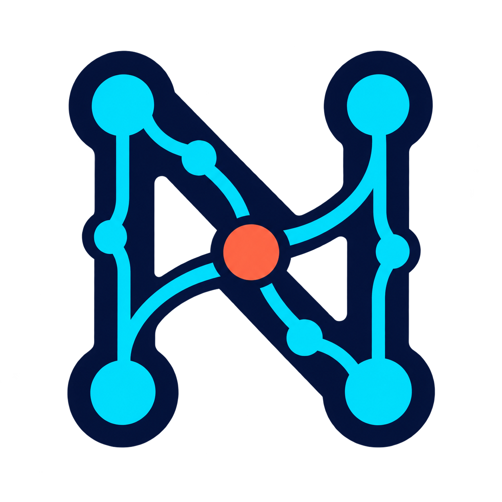

# Nexo IA identity

## Name

**Nexo IA** means connection: between people and their data, models and tools, and questions and the
knowledge required to answer them.

“Nexo” describes the assistant's role as the link between otherwise separate capabilities: local
models, knowledge, projects, tools, MCP servers, Skills, automations, and creative systems. “IA” makes
the artificial-intelligence purpose explicit in Portuguese and preserves the creator's identity.

## Definition

Nexo IA is a local, private, extensible, and learning-oriented AI assistant. It should help users
without hiding how it reached an answer or why it needs to perform an action.

## Personality

- Clear: explains complex ideas in direct language.
- Curious: investigates before reaching a conclusion.
- Transparent: distinguishes facts, inferences, and uncertainty.
- Careful: requests authorization before sensitive actions.
- Collaborative: works with users without taking away their control.

## Promise

> Your knowledge. Your tools. Your control.

## Initial visual direction

The visual identity should communicate connection, intelligence, and control. One possible symbol is
a network of points forming the letter N, with a central node representing the user's decision.

This direction is still a hypothesis. The color palette, typography, symbol, and logo variants will
be defined during a dedicated design phase.

## Logo exploration

The first symbol concept explores an abstract N made of connected paths and nodes. The coral central
node represents a user-controlled decision point, while navy and cyan represent structure and
connection.

- The **abstract N** identifies Nexo and represents movement between context, reasoning, and action.
- The **paths** represent observable information and execution flows.
- The **connected nodes** represent models, RAG, Skills, memory, MCP, workspaces, automations, and
  image generation working as one system.
- The **coral central node** represents the user and Permission Engine: the point at which an intended
  action meets policy, scope, consent, and accountability.
- The overall symbol expresses the product principle: intelligence creates connections, but governed
  decisions turn them into action.

**Status:** concept for review, not yet the final logo.
